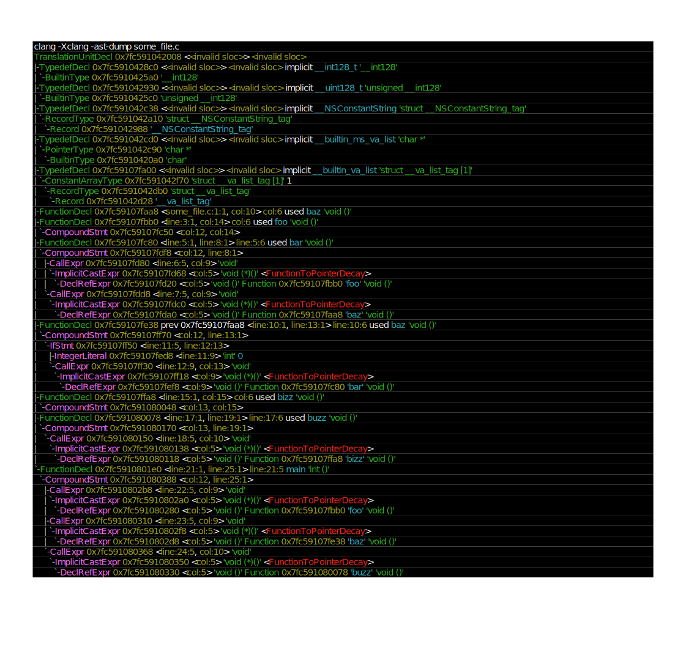

# `can_call`
[](https://github.com/vili-1/can_call)

[](https://github.com/vili-1/can_call)
[](https://github.com/vili-1/can_call/network)
[](https://github.com/vili-1/can_call/stargazers)

[](https://github.com/vili-1/can_call)


<!---[](https://github.com/vili-1/can_call)--->
<!---[](https://github.com/vili-1/can_call/releases/)--->


## About the `can_call`

`can_call` is a toy script to check if there exists a path between two vertices in the execution path of functions that a C program goes through.
`can_call` parses and analyses C code in Python with Clang which enables such usage through `libclang` (with [Python bindings](https://github.com/llvm-mirror/clang/tree/master/bindings/python)).
Clang converts the C-files into an abstract syntax tree (AST) and manipulates the AST by considering nodes (or certain [properties of nodes](https://coggle.it/diagram/VSk7_32dyC9M7Wtk/t/python-clang)).


## Requirements

* LLVM/Clang -- check out the [getting
  started](http://clang.llvm.org/get_started.html) guide to find out how to obtain Clang from source. `libclang` is
  built and installed along with the Clang compiler.

----

**Please note**: Unfortunately, the state of documentation for Python bindings to `libclang` is very lacking. Expect to have to look through the `libclang` API.

----


## Usage

If you are running `can_call` from the terminal, just pass the arguments after the script name as follows:

```console
python3 can_call.py <filename> <caller> <callee>
```
where

- `<filename>` is a C file
- `<caller>` is the name of a function declared in `<some_file.c>`
- `<callee>` is the name of a function declared in `<some_file.c>`

### Example


Suppose we invoke `can_call` on the C-code `some_file.c` below: 

```c
void baz(); // prototype

void foo() { }

void bar() {
    foo();
    baz();
}

void baz() {
    if (0)
        bar();
}

void bizz() { }

void buzz() {
    bizz();
}

int main() {
    foo();
    baz();
    buzz();
}
```

Executing `can_call` to find whether exists a path in the call graph for `some_file.c` from `caller`-function to `callee`-one, given in the table, we get:

| `caller`    | `callee` | Expected Output   |
| ----------- | ---------|----------|
| main        | baz      | True      |
| baz         | bar      | True      |
| buzz        | foo      | None      |
| baz         | baz      | True      |


```console
$ python3 can_call.py some_file.c main baz
True
$ python3 can_call.py some_file.c baz bar
True
$ python3 can_call.py some_file.c buzz foo
None
$ python3 can_call.py some_file.c baz baz
True
```


Clang has a builtin AST-dump mode; below, the `some_file.c` converted into an AST.




## References
`libclang`

> *  <a href="https://eli.thegreenplace.net/2011/07/03/parsing-c-in-python-with-clang"><button type="button" 
style="
            cursor: pointer;
">Eli Bendersky's website
</button></a>
> *  <a href="http://llvm.org/devmtg/2010-11/Gregor-libclang.pdf"><button type="button" 
style="
            cursor: pointer;
">libclang: Thinking Beyond the Compiler
</button></a>
> *  <a href="http://clang.llvm.org/doxygen/group__CINDEX.html"><button type="button" 
style="
            cursor: pointer;
">libclang: C Interface to Clang
</button></a>
> *  <a href="https://github.com/llvm-mirror/clang/blob/master/bindings/python/clang/cindex.py"><button type="button" 
style="
            cursor: pointer;
">clang/bindings/python/clang/cindex.py
</button></a>
